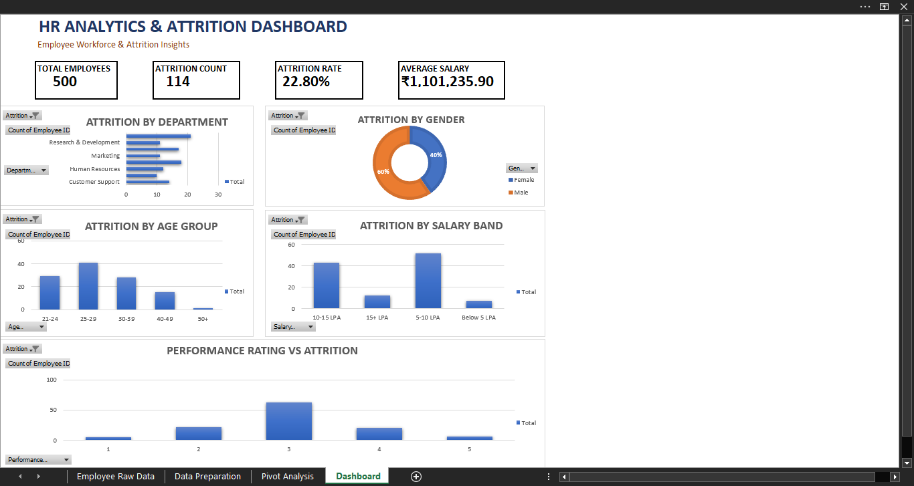

# HR Analytics & Attrition Dashboard

## Project Overview

This project focuses on analyzing employee data to understand workforce patterns and employee attrition using Microsoft Excel.

The project includes data preparation, pivot table analysis, data visualization, and an interactive HR Analytics Dashboard.

The dashboard provides insights into employee attrition based on department, gender, age group, salary band, and performance rating.

---

## Objectives

- Analyze employee attrition trends
- Identify attrition across different departments
- Analyze attrition based on gender and age groups
- Understand the relationship between salary bands and attrition
- Analyze performance rating and employee attrition
- Create an interactive HR Analytics Dashboard

---

## Tools & Technologies

- Microsoft Excel
- Excel Formulas
- Data Cleaning
- Pivot Tables
- Pivot Charts
- Data Visualization
- Dashboard Design

---

## Project Workflow

### 1. Data Preparation

The raw employee dataset was cleaned and prepared for analysis.

The following tasks were performed:

- Data cleaning and validation
- Data organization
- Creation of calculated fields
- Creation of salary bands
- Creation of age groups
- Preparation of data for analysis

---

### 2. Pivot Table Analysis

Pivot Tables and Pivot Charts were created to analyze employee attrition across different categories.

The analysis includes:

- Attrition by Department
- Attrition by Gender
- Attrition by Age Group
- Attrition by Salary Band
- Performance Rating vs Attrition

---

### 3. Dashboard

An HR Analytics & Attrition Dashboard was created to present key workforce insights in a clear and interactive format.

### Key Metrics

- Total Employees: 500
- Attrition Count: 114
- Attrition Rate: 22.8%
- Average Salary: ₹1,101,236

---

## Key Insights

- The dataset contains 500 employees.
- 114 employees have left the organization.
- The overall attrition rate is 22.8%.
- Employee attrition varies across different departments.
- Attrition patterns can be analyzed across different age groups.
- Salary bands provide insights into employee attrition patterns.
- Performance ratings can be compared with employee attrition to identify workforce trends.

---

## Dashboard Analysis

### Attrition by Department

Analyzes employee attrition across different departments and helps identify departments with higher attrition.

### Attrition by Gender

Shows the distribution of employee attrition based on gender.

### Attrition by Age Group

Analyzes employee attrition across different age groups.

### Attrition by Salary Band

Shows attrition across different salary ranges.

### Performance Rating vs Attrition

Analyzes employee attrition based on performance ratings.

---

## Dashboard Preview

---

## Conclusion

This project demonstrates the use of Microsoft Excel for end-to-end HR analytics.

The project covers data preparation, data analysis using Pivot Tables, data visualization, and dashboard development.

The final dashboard provides a clear overview of employee attrition trends and helps support data-driven HR decision-making.

---

## Author

Rahul Kumar

### Skills Demonstrated

- Microsoft Excel
- Data Cleaning
- Data Analysis
- Pivot Tables
- Pivot Charts
- Data Visualization
- Dashboard Development
